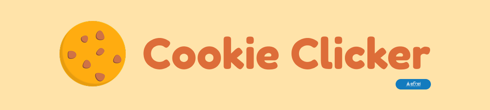

# Cookie Clicker

A Vue 3 + Vuex cookie clicker. Click the cookie, buy upgrades, rank up for permanent multipliers, and climb the leaderboard.

## Features

- **Clicking & upgrades** — 19 upgrades to unlock, from a Cursor to an Infinity Cookie
- **Ranks** — Baker → Gold → Emerald → Diamond → God, each with its own theme, a click/production multiplier, and cheaper upgrades. Ranking up resets your cookies and upgrades, so plan ahead
- **Gordon Ramsay** — unlock him at Gold rank and he'll pop by with the occasional word of encouragement
- **Accounts** — register/log in, and your game auto-saves to your account
- **Roles** — players and admins; admins can edit any player's score or reset their game
- **Leaderboard** — ranked by total cookies collected

## Getting started

```sh
npm install
npm run dev
```

```sh
npm run build
```

A default admin account is seeded on first run: `admin` / `admin`.

## Stack

Vue 3, Vuex 4, Vite.
